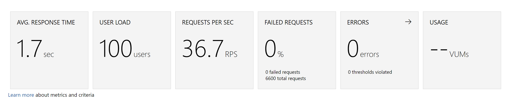
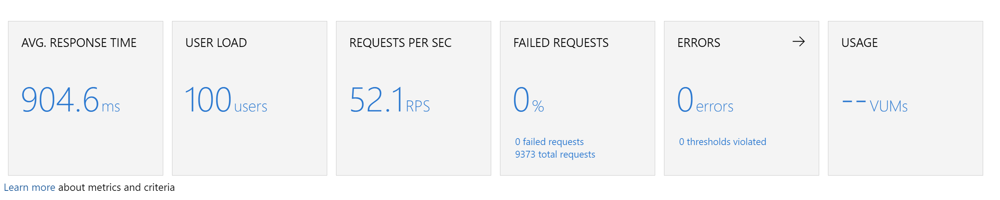

# Custom Thread-Safe Readonly ZipArchive
Default implementation of ZipArchive is not thread-safe, you have to iterate entries one by one to process it.
For our situation, the under stream of ZipArchive is always MemoryStream, we can get the buffer of MemoryStream
to provide a thread-safe ReadOnlyZipArchive, so we can process all the entries at the same time to make higher throughput.

# Benchmark
## Default

## Custom ReadOnly ZipArchive
